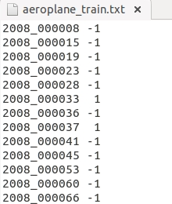

* [paper](paper/2014-The%20pascal%20visual%20object%20classes%20challenge%20A%20retrospective.pdf)
* [PASCAL VOC数据集分析](https://blog.csdn.net/zhangjunbob/article/details/52769381)
* 可以做分类/分割/目标检测

### 分类用到

* `VOCdevkit\VOC2012\ImageSets\Main`下面的文件
* 20个分类的`***_train.txt`、`***_val.txt`和`***_trainval.txt`。

* 前面的表示图像的name，后面的1代表正样本，-1代表负样本。
* `_train`中存放的是训练使用的数据，每一个class的train数据都有5717个。
* `_val`中存放的是验证结果使用的数据，每一个class的val数据都有5823个。
* `_trainval`将上面两个进行了合并，每一个class有11540个。
* 需要保证的是train和val两者没有交集，也就是训练数据和验证数据不能有重复，在选取训练数据的时候 ，也应该是随机产生的。

### 分割

* SegmentationClass和SegmentationObject
*  20 foreground object classes and one background class.
* The original dataset contains 1464 (train), 1449 (val), and 1456 (test) 
* The dataset is augmented by the extra annotations provided by , resulting in 10582(trainaug) training images.
* The performance is measured in terms of pixel intersection-over-union (IOU) averaged across the 21 classes.

### 检测用到

* Annotations
 

## 遇到的问题

### voc用于分割

* 不知道原因，最近使用
    * [Data](pascal_voc/for_segmentation/Data.py)
    * 这里Data中使用PIL的Image的reader方法， 可以直接得到原始数据标签 [0-20]
    * 使用这种方式，目前不能训练，不知道为什么
    * 必须使用转换过得标签，
    
* 正确使用
    * 直接加载原始数据， tf.decode_png解析数来的标签是 [0-255]的，需要额外转换。
    * 先使用 `pascal_voc/utils/convert_labels`将[0-255]的标签转化为[0-20]
    * 然后使用 `pascal_voc/utils/image_reader.py`加载和处理数据

    