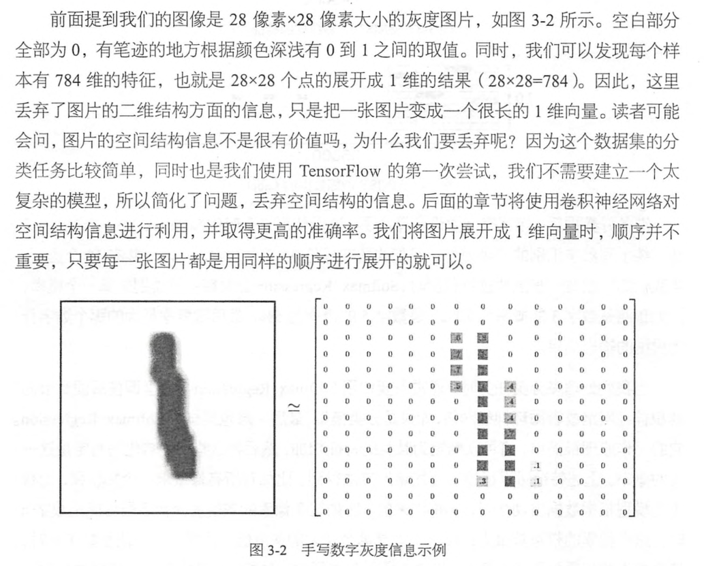

## mnist 

* [study_mnist.py](20.100-mnist/study_minist.py)

* MNIST（Mixed National Institute of Standards and Technology database）是一个非常简单的机器视觉数据集
* 包含28*28像素的手写数字组成，这些图片只包含灰度信息，
* 55000个样本，10000个测试 + 5000个验证

### 数据介绍

