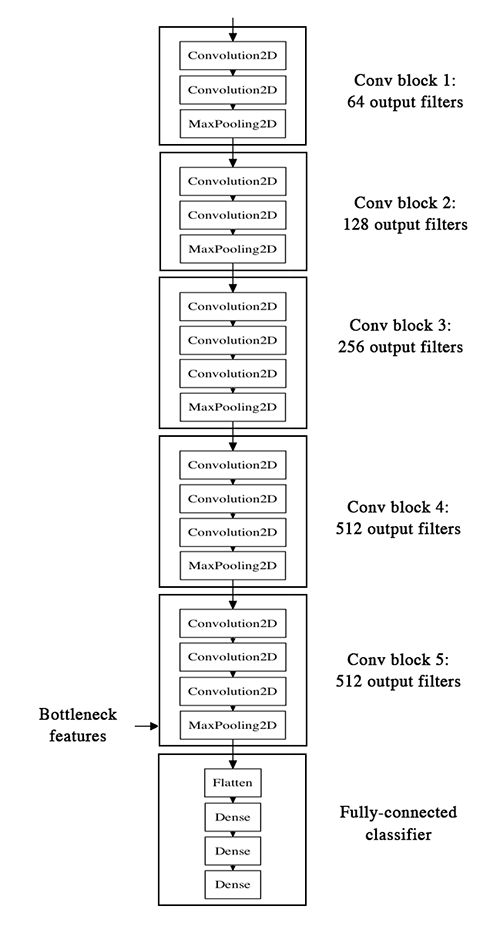

https://blog.keras.io/building-powerful-image-classification-models-using-very-little-data.html


## what

* 在本教程中，我们将介绍一些简单而有效的方法，您可以使用这些方法构建一个功能强大的图像分类器，只使用很少的训练示例 - 只需要您想要识别的每个类中的几百或几千张图片。

* 我们将介绍以下选项：
  * 从头开始训练小型网络（作为基线）
  * 使用预先训练的网络的瓶颈功能
  * 微调预训练网络的顶层

## who(对象是谁)

### Our setup: only 2000 training examples (1000 per class)

* 我们将从以下设置开始：
  * 安装了Keras，SciPy，PIL的机器。 如果你有一个可以使用的NVIDIA GPU（并且安装了cuDNN），这很好，但是因为我们正在使用一些并非绝对必要的图像。
  * 训练数据目录和验证数据目录，每个图像类包含一个子目录，填充.png或.jpg图像：


* 要获得属于您感兴趣的类的数百或数千个训练图像，一种可能性是使用Flickr API在友好许可下下载与给定标记匹配的图片。
* 在我们的例子中，我们将使用两组图片，我们从[Kaggle](https://www.kaggle.com/c/dogs-vs-cats/data)获得：1000只猫和1000只狗（尽管原始数据集有12,500只猫和12,500只狗，我们只为每个类拍摄了前1000张图像）。 我们还使用每个类别的400个额外样本作为验证数据，以评估我们的模型。
* 对于一个远非简单的分类问题，这是很少要学习的例子。 因此，这是一个具有挑战性的机器学习问题，但它也是一个现实的问题：在许多现实世界的使用案例中，即使是小规模的数据收集也可能非常昂贵或有时几乎不可能（例如在医学成像中）。 能够充分利用非常少的数据是有能力的数据科学家的关键技能。


* 这个问题有多难？ 当Kaggle开始参加猫与狗比赛（总共有25,000张训练图像）时，两年多前，它有以下声明：
  * “在多年前进行的一次非正式调查中，计算机视觉专家认为，如果没有现有技术的重大进步，准确度高于60％的分类器将是困难的。作为参考，60％的分类器提高了猜测概率。 从1/4096到1/459的12幅图像HIP。目前的文献表明，机器分类器在这项任务上的准确度可以达到80％以上[参考]。“

* 在最终的比赛中，顶级参赛者通过使用现代深度学习技术获得了超过98％的准确率。 在我们的例子中，因为我们仅将自己限制在数据集的8％，所以问题要困难得多。

### 论深度学习对小数据问题的相关性

* 我经常听到的一条信息是“深度学习只有在你拥有大量数据时才有意义”。虽然不完全不正确，但这有点误导。当然，深度学习需要能够自动从数据中学习特征，这通常只有在有大量训练数据可用时才有可能 - 特别是对于输入样本非常高维的问题，如图像。然而，卷积神经网络 - 深度学习的支柱算法 - 是设计用于大多数“感知”问题（例如图像分类）的最佳模型之一，即使只有很少的数据需要学习。在小图像数据集上从头开始训练一个小天网仍然会产生合理的结果，而不需要任何自定义特征工程。 Convnets很简单。他们是这项工作的正确工具。

* 但更重要的是，深度学习模型本质上是高度可再利用的：例如，您可以采用在大规模数据集上训练的图像分类或语音到文本模型，然后将其重新用于一个显着不同的问题，只需进行微小的更改，如我们将在这篇文章中看到。特别是在计算机视觉的情况下，许多预先训练的模型（通常在ImageNet数据集上训练）现在可以公开下载，并且可以用于从非常少的数据中引导强大的视觉模型。

## where

### 1. Data pre-processing and data augmentation

* 为了充分利用我们的一些训练样例，我们将通过一系列随机变换来“扩充”它们，这样我们的模型就不会看到完全相同的两次图像。 这有助于防止过度拟合，并有助于模型更好地概括。

* 在Keras中，可以通过keras.preprocessing.image.ImageDataGenerator类完成。 该课程允许您：
  * 配置在训练期间对图像数据执行的随机变换和标准化操作
  * 通过.flow（数据，标签）或.flow_from_directory（目录）实例化增强图像批次（及其标签）的生成器。
  * 然后，这些生成器可以与Keras模型方法一起使用，该方法接受数据生成器作为输入，fit_generator，evaluate_generator和predict_generator。

Let's look at an example right away:

```python
from keras.preprocessing.image import ImageDataGenerator

datagen = ImageDataGenerator(
        rotation_range=40,
        width_shift_range=0.2,
        height_shift_range=0.2,
        rescale=1./255,
        shear_range=0.2,
        zoom_range=0.2,
        horizontal_flip=True,
        fill_mode='nearest')
```

* 现在让我们开始使用这个工具生成一些图片并将它们保存到临时目录中，这样我们就可以了解我们的扩充策略正在做什么 - 我们在这种情况下禁用重新缩放以保持图像可显示：

```python
from keras.preprocessing.image import ImageDataGenerator, array_to_img, img_to_array, load_img

datagen = ImageDataGenerator(
        rotation_range=40,
        width_shift_range=0.2,
        height_shift_range=0.2,
        shear_range=0.2,
        zoom_range=0.2,
        horizontal_flip=True,
        fill_mode='nearest')

img = load_img('data/train/cats/cat.0.jpg')  # this is a PIL image
x = img_to_array(img)  # this is a Numpy array with shape (3, 150, 150)
x = x.reshape((1,) + x.shape)  # this is a Numpy array with shape (1, 3, 150, 150)

# the .flow() command below generates batches of randomly transformed images
# and saves the results to the `preview/` directory
i = 0
for batch in datagen.flow(x, batch_size=1,
                          save_to_dir='preview', save_prefix='cat', save_format='jpeg'):
    i += 1
    if i > 20:
        break  # otherwise the generator would loop indefinitely
```

Here's what we get --this is what our data augmentation strategy looks like.


### 2. Training a small convnet from scratch: 80% accuracy in 40 lines of code

* 图像分类工作的正确工具是一个回转网络，所以让我们尝试在我们的数据上训练一个作为初始基线。由于我们只有很少的例子，我们的头号问题应该是过度拟合。当暴露于太少示例的模型学习不推广到新数据的模式时，即当模型开始使用不相关的特征进行预测时，就会发生过度拟合。例如，如果你作为一个人，只能看到三个伐木工人的图像，三个是水手人的图像，其中只有一个伐木工人戴着帽子，你可能会开始认为戴帽子是一个作为一名伐木工人而不是一名水手的标志。然后你会做一个非常糟糕的伐木工人/水手分类器。

* 数据增强是对抗过度拟合的一种方法，但这还不够，因为我们的增强样本仍然是高度相关的。您过度拟合的主要焦点应该是模型的熵能力 - 您的模型可以存储多少信息。通过利用更多功能，可以存储大量信息的模型可能更加准确，但是开始存储不相关的功能也存在风险。同时，只能存储一些功能的模型必须关注数据中发现的最重要的功能，这些功能更有可能真正相关并更好地推广。

* 有不同的方法来调节熵容量。主要的是选择模型中的参数数量，即层数和每层的大小。另一种方法是使用权重正则化，例如L1或L2正则化，其包括迫使模型权重接近较小的值。

* 在我们的例子中，我们将使用一个非常小的convnet，每层有少量层和少量过滤器，以及数据增加和丢失。 Dropout还有助于减少过度拟合，防止图层看到完全相同模式的两倍，从而以类似于数据扩充的方式运行（您可以说丢失和数据增加都会破坏数据中出现的随机关联）。

* 下面的代码片段是我们的第一个模型，一个简单的3个卷积层堆栈，带有ReLU激活，然后是最大池层。这与Yann LeCun在20世纪90年代提倡的用于图像分类的架构（ReLU除外）非常相似。

The full code for this experiment can be found [here](https://gist.github.com/fchollet/0830affa1f7f19fd47b06d4cf89ed44d).

```python
from keras.models import Sequential
from keras.layers import Conv2D, MaxPooling2D
from keras.layers import Activation, Dropout, Flatten, Dense

model = Sequential()
model.add(Conv2D(32, (3, 3), input_shape=(3, 150, 150)))
model.add(Activation('relu'))
model.add(MaxPooling2D(pool_size=(2, 2)))

model.add(Conv2D(32, (3, 3)))
model.add(Activation('relu'))
model.add(MaxPooling2D(pool_size=(2, 2)))

model.add(Conv2D(64, (3, 3)))
model.add(Activation('relu'))
model.add(MaxPooling2D(pool_size=(2, 2)))

# the model so far outputs 3D feature maps (height, width, features)
```

* 最重要的是，我们粘贴了两个完全连接的层。 我们用一个单元和一个sigmoid激活结束模型，这对于二进制分类是完美的。 为此，我们还将使用binary_crossentropy损失来训练我们的模型。

```python
model.add(Flatten())  # this converts our 3D feature maps to 1D feature vectors
model.add(Dense(64))
model.add(Activation('relu'))
model.add(Dropout(0.5))
model.add(Dense(1))
model.add(Activation('sigmoid'))

model.compile(loss='binary_crossentropy',
              optimizer='rmsprop',
              metrics=['accuracy'])
```

* 让我们准备我们的数据。 我们将使用.flow_from_directory（）直接从我们各自文件夹中的jpgs生成批量的图像数据（及其标签）。

```python
batch_size = 16

# this is the augmentation configuration we will use for training
train_datagen = ImageDataGenerator(
        rescale=1./255,
        shear_range=0.2,
        zoom_range=0.2,
        horizontal_flip=True)

# this is the augmentation configuration we will use for testing:
# only rescaling
test_datagen = ImageDataGenerator(rescale=1./255)

# this is a generator that will read pictures found in
# subfolers of 'data/train', and indefinitely generate
# batches of augmented image data
train_generator = train_datagen.flow_from_directory(
        'data/train',  # this is the target directory
        target_size=(150, 150),  # all images will be resized to 150x150
        batch_size=batch_size,
        class_mode='binary')  # since we use binary_crossentropy loss, we need binary labels

# this is a similar generator, for validation data
validation_generator = test_datagen.flow_from_directory(
        'data/validation',
        target_size=(150, 150),
        batch_size=batch_size,
        class_mode='binary')
```

* 我们现在可以使用这些发电机来训练我们的模型。 每个纪元在GPU上需要20-30秒，在CPU上需要300-400秒。 因此，如果您不赶时间，在CPU上运行此模型绝对可行。

```python
model.fit_generator(
        train_generator,
        steps_per_epoch=2000 // batch_size,
        epochs=50,
        validation_data=validation_generator,
        validation_steps=800 // batch_size)
model.save_weights('first_try.h5')  # always save your weights after training or during training
```

* 这种方法使我们在50个时期之后达到0.79-0.81的验证准确度（这个数字是任意选择的 - 因为模型很小并且使用了积极的辍学，到那时它似乎没有过多的过度拟合）。 因此，在推出Kaggle比赛时，我们已经是“最先进的” - 拥有8％的数据，并且没有努力优化我们的架构或超参数。 事实上，在Kaggle比赛中，这个模型将进入前100名（215名参赛者中）。 我想至少有115名参赛者没有使用深度学习;）

### 3. 使用预先训练的网络的瓶颈功能：一分钟内准确率达到90％

* 更精确的方法是利用在大型数据集上预先训练的网络。这样的网络已经学习了对大多数计算机视觉问题有用的特征，并且利用这些特征将使我们能够比仅依赖于可用数据的任何方法获得更好的准确性。

* 我们将使用VGG16架构，该架构在ImageNet数据集上进行了预训练 - 这是此博客之前的模型。因为ImageNet数据集在其总共1000个类中包含几个“猫”类（波斯猫，暹罗猫......）和许多“狗”类，所以该模型已经学习了与我们的分类问题相关的特征。实际上，仅仅记录模型的softmax预测而不是瓶颈特征就足以解决我们的狗与猫的分类问题。然而，我们在这里提出的方法更有可能很好地推广到更广泛的问题，包括ImageNet中缺少类的问题。



* 我们的策略如下：我们只会实例化模型的卷积部分，一切都是完全连接的层。 然后，我们将在训练和验证数据上运行此模型一次，在两个numpy阵列中记录输出（来自VGG16模型的“瓶颈特征”：完全连接层之前的最后激活映射）。 然后，我们将在存储的功能之上训练一个小的完全连接模型。

* 我们之所以离线存储这些功能而不是直接在冻结的卷积基础上添加我们的完全连接模型并运行整个功能，是因为计算效率。 运行VGG16很昂贵，特别是如果你正在使用CPU，我们只想做一次。 请注意，这会阻止我们使用数据扩充。
* You can find the full code for this experiment [here](https://gist.github.com/fchollet/f35fbc80e066a49d65f1688a7e99f069). You can get the weights file [from Github](https://gist.github.com/baraldilorenzo/07d7802847aaad0a35d3). We won't review how the model is built and loaded --this is covered in multiple Keras examples already. But let's take a look at how we record the bottleneck features using image data generators:

```python
batch_size = 16

generator = datagen.flow_from_directory(
        'data/train',
        target_size=(150, 150),
        batch_size=batch_size,
        class_mode=None,  # this means our generator will only yield batches of data, no labels
        shuffle=False)  # our data will be in order, so all first 1000 images will be cats, then 1000 dogs
# the predict_generator method returns the output of a model, given
# a generator that yields batches of numpy data
bottleneck_features_train = model.predict_generator(generator, 2000)
# save the output as a Numpy array
np.save(open('bottleneck_features_train.npy', 'w'), bottleneck_features_train)

generator = datagen.flow_from_directory(
        'data/validation',
        target_size=(150, 150),
        batch_size=batch_size,
        class_mode=None,
        shuffle=False)
bottleneck_features_validation = model.predict_generator(generator, 800)
np.save(open('bottleneck_features_validation.npy', 'w'), bottleneck_features_validation)
```

* We can then load our saved data and train a small fully-connected model:

```python
train_data = np.load(open('bottleneck_features_train.npy'))
# the features were saved in order, so recreating the labels is easy
train_labels = np.array([0] * 1000 + [1] * 1000)

validation_data = np.load(open('bottleneck_features_validation.npy'))
validation_labels = np.array([0] * 400 + [1] * 400)

model = Sequential()
model.add(Flatten(input_shape=train_data.shape[1:]))
model.add(Dense(256, activation='relu'))
model.add(Dropout(0.5))
model.add(Dense(1, activation='sigmoid'))

model.compile(optimizer='rmsprop',
              loss='binary_crossentropy',
              metrics=['accuracy'])

model.fit(train_data, train_labels,
          epochs=50,
          batch_size=batch_size,
          validation_data=(validation_data, validation_labels))
model.save_weights('bottleneck_fc_model.h5')
```

* Thanks to its small size, this model trains very quickly even on CPU (1s per epoch):

```python
Train on 2000 samples, validate on 800 samples
Epoch 1/50
2000/2000 [==============================] - 1s - loss: 0.8932 - acc: 0.7345 - val_loss: 0.2664 - val_acc: 0.8862
Epoch 2/50
2000/2000 [==============================] - 1s - loss: 0.3556 - acc: 0.8460 - val_loss: 0.4704 - val_acc: 0.7725
...
Epoch 47/50
2000/2000 [==============================] - 1s - loss: 0.0063 - acc: 0.9990 - val_loss: 0.8230 - val_acc: 0.9125
Epoch 48/50
2000/2000 [==============================] - 1s - loss: 0.0144 - acc: 0.9960 - val_loss: 0.8204 - val_acc: 0.9075
Epoch 49/50
2000/2000 [==============================] - 1s - loss: 0.0102 - acc: 0.9960 - val_loss: 0.8334 - val_acc: 0.9038
Epoch 50/50
2000/2000 [==============================] - 1s - loss: 0.0040 - acc: 0.9985 - val_loss: 0.8556 - val_acc: 0.9075
```


### 4. Fine-tuning the top layers of a a pre-trained network

* 为了进一步改进我们之前的结果，我们可以尝试与顶级分类器一起“微调”VGG16模型的最后一个卷积块。 微调包括从训练有素的网络开始，然后使用非常小的权重更新在新数据集上重新训练它。 在我们的例子中，这可以通过3个步骤完成：
  * 实例化VGG16的卷积基数并加载其权重
  * 在顶部添加我们先前定义的完全连接模型，并加载其权重
  * 冻结VGG16模型的层到最后一个卷积块


* 注意：
  * 为了进行微调，所有层都应该从训练有素的权重开始：例如，你不应该在预先训练好的卷积基础上打一个随机初始化的全连接网络。这是因为由随机初始化的权重触发的大梯度更新将破坏卷积基础中的学习权重。在我们的例子中，这就是为什么我们首先训练顶级分类器，然后才开始微调卷积权重。
  * 我们选择仅微调最后的卷积块而不是整个网络以防止过度拟合，因为整个网络将具有非常大的熵容量并因此具有过度拟合的强烈倾向。低级卷积块学习的特征比较高级的卷积块更加通用，不那么抽象，所以保持前几个块固定（更一般的特征）并且只调整最后一个块（更专业的特征）是明智的。 ）。
  * 微调应该以非常慢的学习速率完成，通常使用SGD优化器而不是适应性学习速率优化器，例如RMSProp。这是为了确保更新的大小保持非常小，以免破坏以前学过的功能。

* After instantiating the VGG base and loading its weights, we add our previously trained fully-connected classifier on top:

```python
# build a classifier model to put on top of the convolutional model
top_model = Sequential()
top_model.add(Flatten(input_shape=model.output_shape[1:]))
top_model.add(Dense(256, activation='relu'))
top_model.add(Dropout(0.5))
top_model.add(Dense(1, activation='sigmoid'))

# note that it is necessary to start with a fully-trained
# classifier, including the top classifier,
# in order to successfully do fine-tuning
top_model.load_weights(top_model_weights_path)

# add the model on top of the convolutional base
model.add(top_model)
```

* We then proceed to freeze all convolutional layers up to the last convolutional block:

```python
# set the first 25 layers (up to the last conv block)
# to non-trainable (weights will not be updated)
for layer in model.layers[:25]:
    layer.trainable = False

# compile the model with a SGD/momentum optimizer
# and a very slow learning rate.
model.compile(loss='binary_crossentropy',
              optimizer=optimizers.SGD(lr=1e-4, momentum=0.9),
              metrics=['accuracy'])
```

* Finally, we start training the whole thing, with a very slow learning rate:

```python
batch_size = 16

# prepare data augmentation configuration
train_datagen = ImageDataGenerator(
        rescale=1./255,
        shear_range=0.2,
        zoom_range=0.2,
        horizontal_flip=True)

test_datagen = ImageDataGenerator(rescale=1./255)

train_generator = train_datagen.flow_from_directory(
        train_data_dir,
        target_size=(img_height, img_width),
        batch_size=batch_size,
        class_mode='binary')

validation_generator = test_datagen.flow_from_directory(
        validation_data_dir,
        target_size=(img_height, img_width),
        batch_size=batch_size,
        class_mode='binary')

# fine-tune the model
model.fit_generator(
        train_generator,
        steps_per_epoch=nb_train_samples // batch_size,
        epochs=epochs,
        validation_data=validation_generator,
        validation_steps=nb_validation_samples // batch_size)
```

* 这种方法使我们在50个时期之后达到0.94的验证准确度。 巨大的成功！

* 以下是一些您可以尝试达到0.95以上的方法：
  * 更具侵略性的数据增加
  * more aggressive dropout
  * 使用L1和L2正则化（也称为“重量衰减”）
  * 微调一个卷积块（同时更大的正则化）