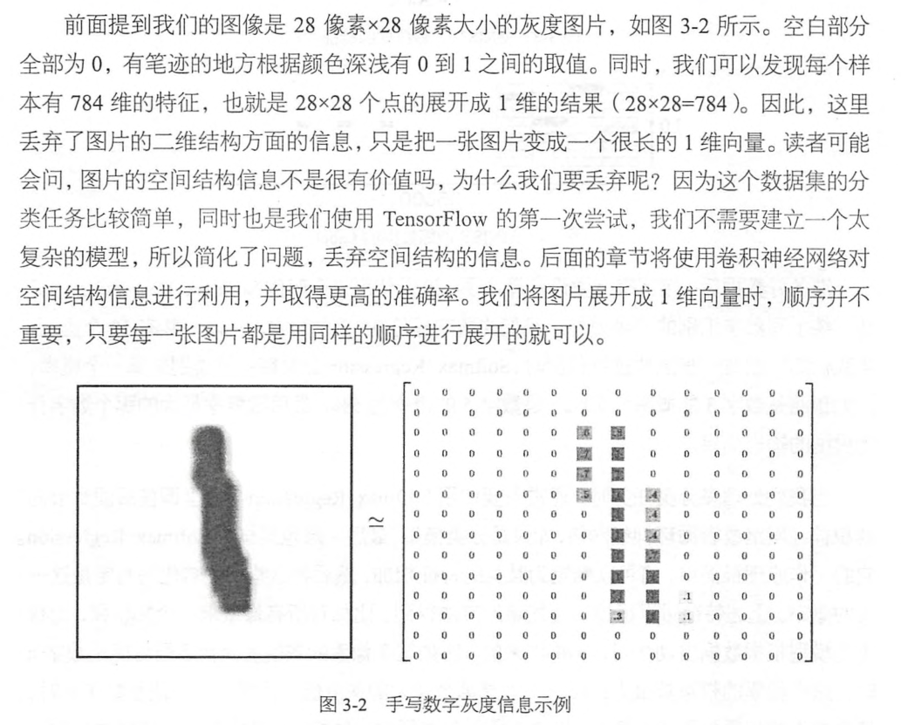
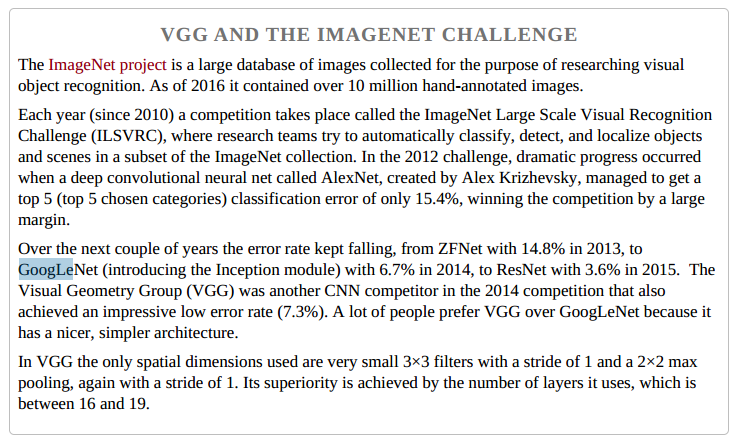

# 概述深度学习中数据

## mnist 

* [study_mnist.py](mnist/study_minist.py)

* MNIST（Mixed National Institute of Standards and Technology database）是一个非常简单的机器视觉数据集
* 包含28*28像素的手写数字组成，这些图片只包含灰度信息，
* 55000个样本，10000个测试 + 5000个验证

### 数据介绍






## cifar 

* 包含60000张32x32的彩色图像， 
* 训练集 50000， 测试集 10000
* cifar10
    * 10类， 每一类图片6000张
    * airplane, automobile, bird, cat, deer, dog, frog, horse, ship, truck
* CIFAR-100
    * 100 classes
    * 一些类别很小， 例如，包含5种树: maple, oak, palm, pine, and willow. 

* 这里应该存在两种cifar数据，
    * 一种是tensorflow封装过的 record数据， 这种数据后缀都是bin问题
    * 一种是python的可以使用pickle.load 加载的文件，这种文件区别只是没有bin后缀
* [CNN训练Cifar-10技巧](http://www.cnblogs.com/neopenx/p/4480701.html)

### 一些结果
* alexnet 
    *  a four-layer CNN achieved a 13% test error rate without normalization and 11% with normalization




## voc

* [PASCAL VOC数据集分析](https://blog.csdn.net/zhangjunbob/article/details/52769381)
* 可以做分类/分割/目标检测

### 分类用到

* `VOCdevkit\VOC2012\ImageSets\Main`下面的文件
* 20个分类的`***_train.txt`、`***_val.txt`和`***_trainval.txt`。


* 前面的表示图像的name，后面的1代表正样本，-1代表负样本。
* `_train`中存放的是训练使用的数据，每一个class的train数据都有5717个。
* `_val`中存放的是验证结果使用的数据，每一个class的val数据都有5823个。
* `_trainval`将上面两个进行了合并，每一个class有11540个。
* 需要保证的是train和val两者没有交集，也就是训练数据和验证数据不能有重复，在选取训练数据的时候 ，也应该是随机产生的。


### 分割

* SegmentationClass和SegmentationObject


### 检测用到

* Annotations
 



## imagenet

 
* [数据集下载](https://blog.csdn.net/haoji007/article/details/77005538)
* [ImageNet classification with Python and Keras](https://www.pyimagesearch.com/2016/08/10/imagenet-classification-with-python-and-keras/)



## Tiny-imagenet-200

* 100k training, 10k validation, and 10k test images of dimensions 64x64x3. 
* There are a total of 500 images per class with 200 distinct classes. 



## resisc 45


* 用于分类的遥感数据

* 西北工业大学出的数据集

* 45类别
* 每类 700张数据




## 数据增强

* [data_augument.md](data_argument.md)
















## 样本不均衡
* [训练集样本不平衡问题对CNN的影响](https://zhuanlan.zhihu.com/p/23444244)
* [The Impact of Imbalanced Training Data for Convolutional Neural Networks](paper/The%20Impact%20of%20Imbalanced%20Training%20Data%20for%20Convolutional%20Neural%20Networks.pdf)

