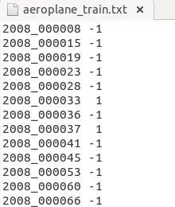

* [PASCAL VOC数据集分析](https://blog.csdn.net/zhangjunbob/article/details/52769381)

* 可以做分类/分割/目标检测

### 分类用到
    * VOCdevkit\VOC2012\ImageSets\Main下面的文件
    * 20个分类的***_train.txt、***_val.txt和***_trainval.txt。
    
    
    * 前面的表示图像的name，后面的1代表正样本，-1代表负样本。
    _train中存放的是训练使用的数据，每一个class的train数据都有5717个。
    _val中存放的是验证结果使用的数据，每一个class的val数据都有5823个。
    _trainval将上面两个进行了合并，每一个class有11540个。
    需要保证的是train和val两者没有交集，也就是训练数据和验证数据不能有重复，在选取训练数据的时候 ，也应该是随机产生的。

### 分割

* SegmentationClass和SegmentationObject

### 检测用到

* Annotations
 